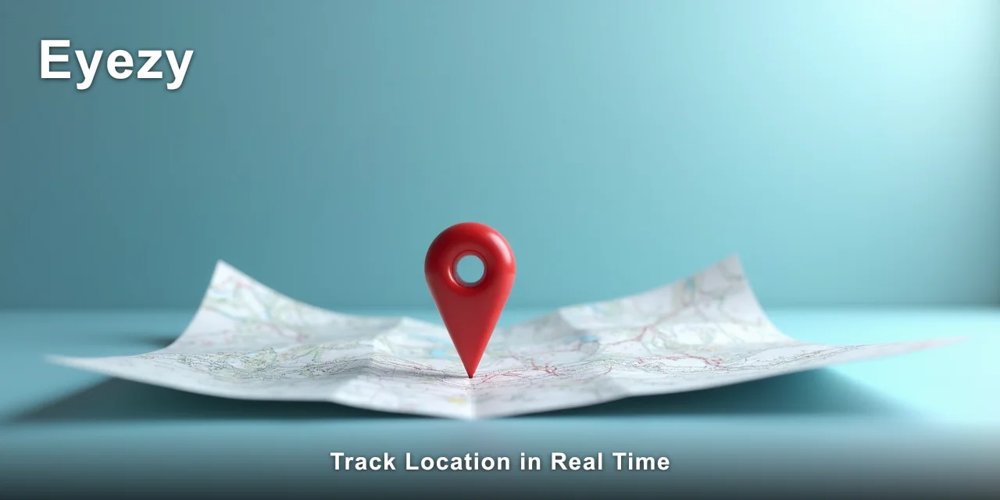
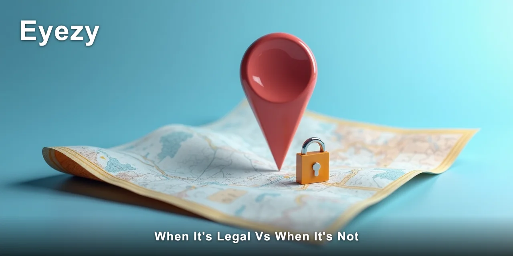

# Is It Legal to Track Location in Real Time?

Yes, it is legal to track location in real time — but only under specific conditions that depend on who owns the device, who the person is, and where you live. The legality hinges almost entirely on consent and parental rights, not on the technology itself.

Tracking a location in real time on a phone you own or a minor child's device is generally lawful; doing it on an adult partner's phone without their knowledge usually is not.

> [!NOTE]
> Quick answer: You can legally track location in real time when you own the device, or when the person being tracked is your minor child and you're exercising parental responsibility. Tracking an adult without their consent is illegal in most jurisdictions and can carry criminal penalties.
>
> The same monitoring app can be lawful in one scenario and a crime in another.

The gap between what a phone tracker can do and what the law permits is wider than most people expect. I've seen parents assume they can monitor an adult child's phone, and partners assume that paying the phone bill grants them access to location data.

Neither assumption holds up in court. The tool itself — whether a built-in feature or a dedicated monitoring app — is neutral.

The legal question is always about the relationship, the consent, and the jurisdiction.

Most people searching for location tracking expect a simple yes or no answer. The reality is more layered. The legality of tracking location in real time depends on a handful of conditions that are easy to misunderstand, and the consequences of getting them wrong are serious.

That's why I'm going to walk through the legal framework, the specific situations where monitoring is allowed, and the risks you take when the conditions aren't met.

🔗 **[Eyezy handles the part of this that manual checking can't reach.](https://redirectseo.com/e-en)**

## Contents

- [What the Law Actually Says About Real-Time Location Tracking](#what-the-law-actually-says-about-real-time-location-tracking)
- [When It's Legal vs When It's Not](#when-its-legal-vs-when-its-not)
- [How the Law Differs by Country and State](#how-the-law-differs-by-country-and-state)
- [The Safety and Privacy Risks You Should Know](#the-safety-and-privacy-risks-you-should-know)
- [Ethical Considerations Beyond the Law](#ethical-considerations-beyond-the-law)
- [What Responsible Monitoring Looks Like in Practice](#what-responsible-monitoring-looks-like-in-practice)
- [✅ Fast Recap](#-fast-recap)
- [Frequently Asked Questions](#frequently-asked-questions)

## What the Law Actually Says About Real-Time Location Tracking

Location data is treated as sensitive personal information in most legal systems. The core principle is simple: **the person being tracked has a reasonable expectation of privacy** unless that expectation has been waived by consent, or overridden by a legal relationship like parent and minor child.

Courts have consistently ruled that a phone is a private space. In the United States, the Supreme Court's decision in Riley v.

California (2014) established that phones contain the "privacies of life" and warrant protection. Similar principles appear in UK case law and in EU data protection rulings.

When you track location in real time on someone's device without their knowledge, you're accessing that private space without authorisation.

Four legal concepts matter more than any other when assessing whether a monitoring setup is lawful:

- **Consent:** Explicit, informed agreement from the person being tracked is the strongest legal foundation. Written consent is better than verbal.
- **Device ownership:** If you purchased the phone and pay for the service plan, you have stronger legal standing — but ownership alone doesn't override an adult user's privacy rights.
- **Parental rights:** Parents have broad legal authority to monitor minor children's devices, grounded in the duty to protect and the right to direct their upbringing.
- **Reasonable expectation of privacy:** An adult using a phone has this expectation by default. It can only be removed through consent, employment agreements, or court orders.

A tracking tool that captures GPS coordinates, route history, and location-based alerts is accessing all of these protected areas. The legal boundaries aren't about the software's capability — they're about whether the person being monitored has a privacy right that you're violating.

In practice, I've noticed that people rarely think about the legal framework until after a situation has gone wrong. A partner discovers they're being tracked and presses charges.

A parent tries to monitor a 19-year-old and finds themselves on the wrong side of a privacy complaint. The technology works exactly as advertised — but the law treats the use case differently.

## When It's Legal vs When It's Not

The clearest way to understand the legal boundaries is to look at specific situations side by side. The same tracking feature can be perfectly lawful in one context and a criminal offence in another.

| Situation | Legal? | Why |
| --- | --- | --- |
| Monitoring your minor child's device | Generally yes | Parental rights over minors override the child's privacy expectations |
| Monitoring a partner without consent | Generally no | No waiver of reasonable expectation of privacy; potential stalking or surveillance offence |
| Tracking your own device remotely | Yes | You own the device and the data; no third party's privacy is involved |
| Monitoring an employee's company-issued phone | Depends | Legal if disclosed in the employment contract and policy; illegal if hidden |
| Tracking an adult child who lives at home | Depends | Parental rights end at 18 in most jurisdictions; consent becomes required |
| Using a court-ordered monitoring arrangement | Yes | Judicial authorisation overrides privacy expectations |

That middle row — monitoring a partner without consent — is where most legal trouble happens. In the UK, the Protection from Harassment Act 1997 and the newer Domestic Abuse Act 2021 both capture persistent location tracking as a form of abuse.

In the US, most states have stalking statutes that explicitly include electronic surveillance. The penalties range from restraining orders to felony charges.

> [!IMPORTANT]
> The single condition that turns lawful monitoring into a criminal offence is the absence of consent from an adult person being tracked. Even if you own the phone, even if you pay the bill, tracking an adult's location in real time without their knowledge can be prosecuted as stalking, harassment, or unlawful surveillance.
>
> This is not a grey area — it is a hard legal line.

Jurisdiction changes these answers more than any other factor. A behaviour that's lawful in one state or country can be a felony in another. The next section breaks down the differences.

## How the Law Differs by Country and State

Location tracking law varies significantly across jurisdictions. If you're considering monitoring a device, the first question isn't "can this app do it" — it's "what does the law in my location say about it."

### United States

The US has no single federal law governing location tracking. Instead, a patchwork of state statutes applies.

California has some of the strictest privacy protections, including the California Invasion of Privacy Act, which requires all parties to consent to certain types of electronic surveillance. Texas criminalises the installation of tracking devices on vehicles without consent.

Most states permit parental monitoring of minors but draw the line at adults. The federal Stored Communications Act also prohibits unauthorised access to stored electronic communications, which can include location history.

### United Kingdom

The UK treats location data as personal data under the Data Protection Act 2018 and the UK GDPR. Tracking someone's location in real time without their knowledge is likely to breach data protection principles.

More significantly, it can constitute an offence under the Protection from Harassment Act 1997 if the behaviour causes alarm or distress. The Investigatory Powers Act 2016 also restricts the interception of communications data.

Parental monitoring of children is generally acceptable, but the expectation of transparency is higher than in the US.

### European Union

The GDPR applies across all member states and is strict about location data. It's classified as personal data, and processing it requires a lawful basis — usually consent.

The ePrivacy Directive adds another layer, requiring consent for accessing information stored on a device. This means that even in a family context, covert tracking of location in real time can breach EU data protection law.

Some member states, like Germany, have additional criminal provisions against unauthorised surveillance.

### Australia

Australia's Privacy Act 1988 covers location data as personal information. The Surveillance Devices Act 2004 (at the federal level) and state equivalents restrict the use of tracking devices.

Tracking an adult's location without consent is likely to breach these laws and can carry criminal penalties. Parental monitoring of minors is generally lawful, but the child's age and the reasonableness of the monitoring matter.

The law is actively evolving. As of early 2026, several US states are considering stricter electronic surveillance statutes, and the EU is reviewing how the Digital Services Act applies to location data. If you're relying on a specific legal interpretation, it's worth checking whether recent changes affect your situation.

Monitoring apps like Eyezy are designed with these legal frameworks in mind. The dashboard requires the person setting up monitoring to confirm they have legal authority — either as a parent of a minor or with the device owner's consent.

The app itself doesn't make the legal determination; it's a tool that can be used within the law or outside it.

The technology also works differently across platforms, which affects the legal picture. On iPhone, **Eyezy** uses iCloud sync rather than direct installation — no physical access to the target device is needed. On Android, a one-time installation is required, which changes the consent dynamics. Neither approach alters the underlying legal requirement for authorisation.

Jurisdiction isn't just about where you live — it's also about where the person being tracked lives and where the device is used. If you're in the US but your partner is in the UK, the stricter of the two legal regimes may apply.

This gets complicated quickly, which is why local legal advice is worth getting before you rely on any interpretation.

## The Safety and Privacy Risks You Should Know

Beyond legality, there are practical risks that people tend to underestimate. I've seen these play out in real situations, and they're often more damaging than the legal consequences.

- **Data security:** Location data is highly sensitive. If the monitoring dashboard is compromised, the person tracking has exposed their own activity, their location history, and potentially the target's routines.
- **Account exposure:** On iPhone setups using iCloud, the monitoring app requires the iCloud credentials. If those credentials leak, the person being tracked loses access to their own account — or worse, the attacker gains full account control.
- **Detection and relationship damage:** Most monitoring apps operate invisibly, but no solution is perfect. A single notification, a battery drain, or a suspicious app permission can reveal the monitoring. The trust damage in a relationship is often irreparable.
- **Escalation risk:** In domestic situations, discovering surveillance can escalate conflicts dangerously. The person being tracked may feel violated, and the person doing the tracking may respond defensively.
- **Legal exposure:** Civil lawsuits for invasion of privacy are increasingly common. Even if criminal charges aren't filed, the target of surveillance can sue for damages.

> [!WARNING]
> The risk people underestimate most is the data trail left by the monitoring itself. Every location check, every route replay, every alert generates records. If the relationship ends or the situation escalates, those records can be subpoenaed and used against the person who did the monitoring. What felt like a private safeguard becomes evidence in a legal proceeding.

The emotional dimension matters too. I've noticed that people who track a partner's location in real time often become more anxious, not less. The reassurance they expected doesn't materialise — instead, every unexplained stop becomes a source of worry. The tool tends to feed the fear rather than calm it.

For parents, the risk is different. Monitoring a child's location is usually well-intentioned, but teenagers often view it as a breach of trust. The digital safety benefit has to be weighed against the relationship cost. Many parents find that a transparent conversation about monitoring is more effective than a covert setup.

The data security angle is worth dwelling on. When you track location in real time, you're creating a permanent record of someone's movements. That record includes home addresses, workplaces, schools, medical appointments, and social patterns. If that data is stored in the cloud, it's subject to the security practices of the monitoring provider. A breach could expose everything.

## Ethical Considerations Beyond the Law

Legal and ethical are not the same thing. I've encountered situations where monitoring was technically lawful but clearly wrong, and others where the law was ambiguous but the ethical case was strong.

The core ethical question is about respect for autonomy. A person's movements are deeply personal information. Even a minor child — especially a teenager — is developing their own sense of self, and constant surveillance can undermine that development. The habit-driven patterns matter here: occasional check-ins are different from continuous tracking.

There's also a fairness question. Would you be comfortable being tracked the same way? If the answer is no, it's worth asking why you're comfortable imposing that on someone else. This isn't a rhetorical question — it's a genuine test of whether the monitoring is about safety or control.

For parents, the ethical calculus is more nuanced. Protecting a child from genuine danger is a real time responsibility, and location tracking can be a legitimate part of that.

But the same tool that protects can also suffocate. The difference is usually in the transparency and the scope — a child who knows about the monitoring and understands why it exists is in a very different position from one who discovers they've been tracked for years without knowing.

I've also seen situations where monitoring was a symptom of a deeper relationship problem. A partner who feels the need to track location in real time is usually dealing with trust issues that no amount of surveillance will resolve. The tracking becomes a substitute for communication — and it rarely works.

## What Responsible Monitoring Looks Like in Practice

If you've decided that location monitoring is appropriate for your situation, there are ways to do it that stay within both legal and ethical boundaries. These aren't legal advice — they're the patterns I've observed in setups that work without causing harm.

- [ ] Have a transparent conversation about the monitoring before enabling it
- [ ] Limit the scope to what genuinely needs to be tracked — not every movement
- [ ] Use a monitoring solution that stores data securely and doesn't expose it publicly
- [ ] Set a review date — monitoring shouldn't continue indefinitely without re-evaluation
- [ ] Be prepared to stop if the monitoring is causing more harm than good

For parents, the most effective approach I've seen combines transparency with boundaries. Tell your child what you're doing and why. Explain the safety concerns that led you to consider monitoring. Give them a voice in how the monitoring is configured. This doesn't eliminate the awkwardness, but it preserves trust.

For anyone considering monitoring an adult, the only responsible approach is explicit consent. If you can't ask, the answer is no. If you can ask, the conversation itself often resolves the underlying concern.

The legal framework is clear: tracking location in real time is lawful when it's done with proper authorisation — either parental authority over a minor, or informed consent from the device user. Outside those boundaries, it's not a grey area. It's a violation with real consequences.

You now have the legal picture and the practical considerations. The decision about whether to track location in real time has to be made in your specific context, with your specific relationship, under your specific jurisdiction's laws.

🔍 **[Eyezy covers this specific case in a way most of the free alternatives don't.](https://redirectseo.com/e-en)**

If you're uncertain about your situation, the safest course is to talk to a lawyer in your jurisdiction before enabling any monitoring. A short consultation is far cheaper than a legal defence.

## ✅ Fast Recap

- Tracking location in real time is legal only with consent or parental authority over a minor
- Tracking an adult without consent is illegal in most jurisdictions and can be a criminal offence
- Device ownership alone does not give you the right to track an adult user
- Parental rights apply to minor children only — they end at 18 in most places
- Jurisdiction matters: UK, EU, US, and Australian laws differ significantly
- Location data is sensitive — a breach exposes routines, workplaces, and homes
- Transparent monitoring preserves trust; covert monitoring usually destroys it

## Frequently Asked Questions

### Is it legal to track my spouse's phone without them knowing?

No, it is not legal in most jurisdictions. Tracking a spouse's location in real time without their consent is likely to breach stalking laws, privacy statutes, or data protection regulations. The fact that you're married does not remove their reasonable expectation of privacy.

### Can I track my child's location after they turn 18?

Parental rights to monitor a child's device typically end at 18. After that age, your child is an adult with full privacy rights, and tracking their location in real time without consent is unlawful in most places. If you're concerned about an adult child's safety, the conversation has to change — consent becomes the only legal foundation.

### Does owning the phone make tracking legal?

Owning the device strengthens your position but doesn't automatically make tracking lawful. Courts have held that phone ownership alone doesn't override an adult user's privacy expectations. You also need either consent or a lawful basis like parental authority over a minor.

### What's the difference between parental controls and spyware?

Parental controls are monitoring features designed for use on a minor child's device, often with the child's knowledge. Spyware implies covert surveillance without the target's awareness. The legal distinction is the same as the technical one: transparency and authority.

### Is it legal to track an employee's company phone?

It's legal if the monitoring is disclosed in the employment contract or policy, and if it's limited to work-related activity. Hidden tracking of an employee's location in real time, especially outside work hours, is likely to breach privacy laws and employment regulations.

### What happens if I'm caught tracking someone without consent?

Consequences vary by jurisdiction but can include criminal charges for stalking or harassment, civil lawsuits for invasion of privacy, restraining orders, and in some cases, felony convictions. The monitoring data itself can become evidence against you.

The legal landscape around location tracking is complex, and the stakes are high. If you're in any doubt about your specific situation, professional legal advice is the right step. The technology is available — but the law draws the boundaries, and those boundaries are there for good reasons.

Now that you understand the full picture — the legal conditions, the jurisdiction differences, and the practical risks — you're in a position to make an informed decision.

👉 **[See the current Eyezy plans and features](https://redirectseo.com/e-en)**